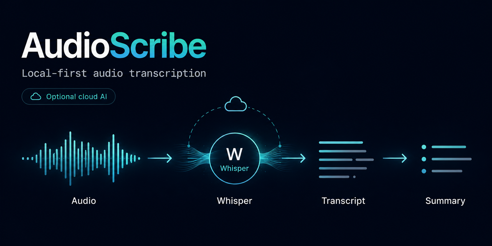

# AudioScribe

<p align="center">
  
</p>

<p align="center">
  <strong>Local-first audio and video transcription with a simple CLI, reproducible outputs, and optional OpenAI cloud transcription.</strong>
</p>

<p align="center">
  <a href="#quick-start">Quick start</a>
  ·
  <a href="#backends">Backends</a>
  ·
  <a href="#codex-skill">Codex skill</a>
  ·
  <a href="docs/technical-guide.md">Technical guide</a>
  ·
  <a href="docs/amd-rocm.md">AMD ROCm/HIP</a>
</p>

<p align="center">
  
  
  
  
</p>

AudioScribe turns recordings into clean Markdown transcripts and metadata files. It is built for people who want a practical transcription pipeline they can run from the terminal: local when privacy or cost matters, cloud-backed when convenience matters.

## Why AudioScribe

- **Local-first by default**: use `faster-whisper` on CPU, NVIDIA CUDA, or experimental AMD ROCm/HIP without sending media to an external service.
- **Cloud when you want it**: switch to OpenAI transcription with one `.env` setting and an API key.
- **Batch-friendly outputs**: transcribe a file or a folder and get one organized output directory per source file.
- **Reproducible skips**: completed transcripts are skipped when the source hash and transcription settings still match.
- **Codex-ready**: includes an installable Codex skill so agents can use the project after a fresh clone.
- **Common formats**: supports `.mp3`, `.m4a`, `.wav`, `.mp4`, `.mov`, `.webm`, `.ogg`, `.flac`, and `.aac`.

## Quick Start

```bash
git clone https://github.com/AIF31/AudioScribe.git
cd AudioScribe

python3 -m venv .venv
source .venv/bin/activate
python -m pip install -e ".[dev]"

cp .env.example .env
audio-transcribe transcribe-file ./data/audio_raw/example.m4a
```

For NVIDIA GPU acceleration, install the CUDA extras:

```bash
python -m pip install -e ".[dev,cuda]"
source scripts/setup_cuda_env.sh
cp .env.cuda.low-vram.example .env
audio-transcribe check-accelerator
```

For **experimental** AMD ROCm/HIP acceleration, install AudioScribe without CUDA extras, then install a ROCm/HIP-enabled CTranslate2 wheel from the CTranslate2 release page or build CTranslate2 with `-DWITH_HIP=ON`:

```bash
python -m pip install -e ".[dev]"
cp .env.rocm.example .env
audio-transcribe check-accelerator
```

ROCm/HIP support is experimental and is not enabled by the `rocm` extra alone. AMD users must install a ROCm/HIP-enabled CTranslate2 wheel or build CTranslate2 with HIP support. See [docs/amd-rocm.md](docs/amd-rocm.md) and [docs/windows-hip.md](docs/windows-hip.md).

## Backends

Choose the backend in `.env`.

```env
TRANSCRIPTION_BACKEND=faster-whisper
WHISPER_MODEL_NAME=large-v3
WHISPER_DEVICE=cpu
WHISPER_COMPUTE_TYPE=int8
```

Use local mode when you want transcription to run on your own machine. Switch `WHISPER_DEVICE=cuda` and `WHISPER_COMPUTE_TYPE=float16` for GPU-backed runs. CPU mode (`WHISPER_DEVICE=cpu`) is significantly slower and only recommended for short or small files.

AMD ROCm/HIP support is experimental. It depends on the GPU, OS, ROCm/HIP runtime, and CTranslate2 wheel/build compatibility. Select it with `WHISPER_ACCELERATOR=rocm` and keep `WHISPER_DEVICE=cuda`; CTranslate2/faster-whisper use `device="cuda"` for GPU execution on ROCm builds.

`WHISPER_ACCELERATOR` names the user-facing runtime family. `WHISPER_DEVICE` is the device string passed to CTranslate2. For both NVIDIA CUDA and AMD ROCm/HIP GPU execution, that device string is `cuda`.

| Runtime | Status | Install path | Notes |
|---|---|---|---|
| CPU | Stable | `python -m pip install -e ".[dev]"` | Best fallback; use `WHISPER_ACCELERATOR=cpu`, `WHISPER_DEVICE=cpu`, `WHISPER_COMPUTE_TYPE=int8`, `WHISPER_BATCH_SIZE=1`. |
| NVIDIA CUDA | Stable | `python -m pip install -e ".[dev,cuda]"` + `source scripts/setup_cuda_env.sh` | Existing path; use `WHISPER_ACCELERATOR=cuda`, `WHISPER_DEVICE=cuda`. |
| AMD ROCm/HIP | Experimental | Install AudioScribe without CUDA extras, then install a ROCm/HIP-enabled CTranslate2 wheel or build CTranslate2 with `-DWITH_HIP=ON`. | Use `WHISPER_ACCELERATOR=rocm` and keep `WHISPER_DEVICE=cuda`. |
| OpenAI cloud file | Stable | `TRANSCRIPTION_BACKEND=openai-whisper` | No local GPU. |
| OpenAI realtime | Experimental | `TRANSCRIPTION_BACKEND=openai-realtime-whisper` | No local GPU. |

```env
TRANSCRIPTION_BACKEND=openai-whisper
OPENAI_API_KEY=sk_your_openai_api_key_here
OPENAI_WHISPER_MODEL=whisper-1
```

Use cloud mode when you prefer an API-backed workflow. Keep real keys only in `.env`; the file is ignored by Git. Note: the OpenAI Audio Transcriptions API has a 25 MB file upload limit. For larger files, use the `faster-whisper` local backend.

AudioScribe creates a predictable output folder for each input file:

```text
data/transcripts/example/
  example_transcript.md
  example_metadata.json
```

The transcript is written for reading and review. The metadata records the backend, model, accelerator, device, language, source hash, and segment count so repeated runs can be compared safely. For an AMD GPU run, successful metadata should show `requested_accelerator: rocm`, `accelerator: rocm`, and `device: cuda`.

## CLI

```bash
# Inspect the active configuration
audio-transcribe inspect-config

# Check CPU, CUDA, or ROCm/HIP runtime configuration
audio-transcribe check-accelerator

# Transcribe one file
audio-transcribe transcribe-file ./data/audio_raw/example.m4a

# Transcribe a folder
audio-transcribe transcribe-batch \
  --input-dir ./data/audio_raw \
  --output-dir ./data/transcripts
```

## Codex Skill

AudioScribe ships with a Codex skill in `codex/skills/audio-transcription`. Install it after cloning:

```bash
scripts/install_codex_skill.sh
```

After restarting Codex, use the `audio-transcription` skill to transcribe audio or video files through the same local or cloud backends. See [docs/codex-skill.md](docs/codex-skill.md).

## Documentation

- [Technical guide](docs/technical-guide.md): CUDA setup, realtime settings, configuration reference, and troubleshooting.
- [AMD ROCm/HIP guide](docs/amd-rocm.md): experimental AMD GPU setup and troubleshooting.
- [Windows HIP SDK guide](docs/windows-hip.md): AMD Windows GPU setup for cards such as the RX 6950 XT.
- [Codex skill guide](docs/codex-skill.md): installing and using the bundled Codex skill.
- [.env.example](.env.example): documented configuration template with safe placeholder values.

## Project Status

AudioScribe is intentionally small: a focused CLI, clear configuration, and transcript outputs that are easy to review or feed into downstream workflows.
